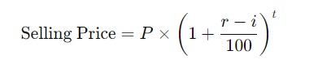
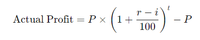
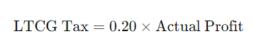
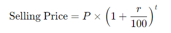
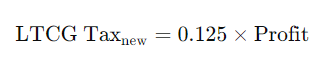
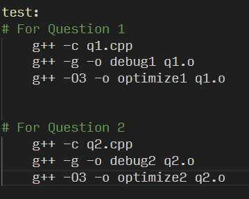

## **Object Oriented Programming and Design: Assignment 1**

### **_Question 1:_**

- > **We have to calculate Longterm Capital Gain Tax and Selling Price**
- > _We have formula of SellingPrice is:_  
- > _Profit:  _
- > _LTCG Tax: (SellingPrice - CostPrice) x taxPercentage_ - Here we takes 20% taxPercentage on profit. 

> > **Here we takes input from user in which year they wants to sell their properties.**

- - _Initially Brought Year: 2010_
- - _Brought Price: 50 Lakhs_
- - _Find Selling Price_
- - _Find LTCG Tax_

---

---

---

### **_Question 2:_**

- > **We have to calculate Longterm Capital Gain Tax and Selling Price**
- > _Here we have to change Selling Price Formulla:_
- > - _Before 2024:_ 
- > - _On and After 2024:_ 
- > _Profit:_
- > - _Before 2024:_ 
- > - _On and After 2024:
- > _LTCG Tax:_
- > - _Before 2024 (Here we takes 20% taxPercentage on profit):_  
- > - _On and After 2024 (But in and after 2024 we takes 12.5% taxPercentage on profit according new policy):_ 

> > **Here we takes input from user in which year they wants to sell their properties.**

- - _Initially Brought Year: 2010_
- - _Brought Price: 50 Lakhs_
- - _Find Selling Price_
- - _Find LTCG Tax_

> #### Here we have to create make file it shown like that: 
> > - **In Makefile we write some terminal commands.**
> > - ***-c :** command used to compiler cpp file without creating object file (.o).*
> > - ***-g :** command used to Debuggs compiled file and **' -o '** used to assing name of the output files like debug1, debug2, so on. [Shown in image].*
> > - ***-O3 :** This is called obtimised flag command which helps to optimize our code.* 

>>>> REFERENCE: https://en.cppreference.com/w/ and youtube
